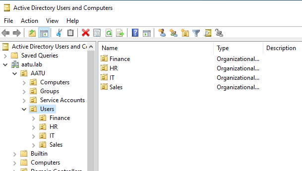
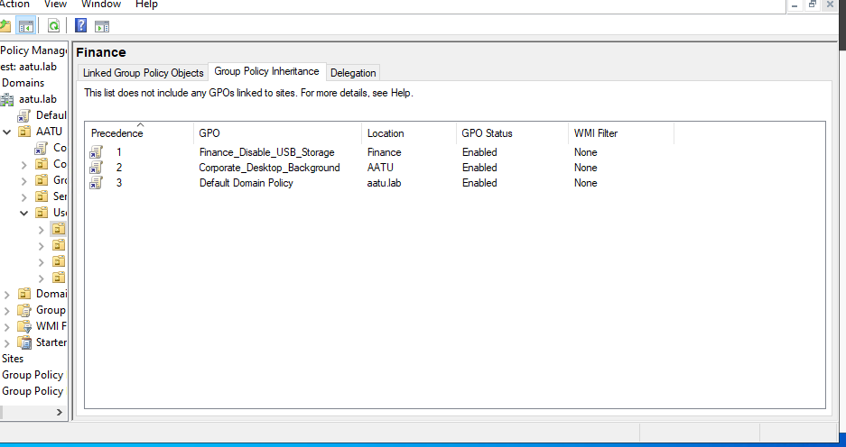
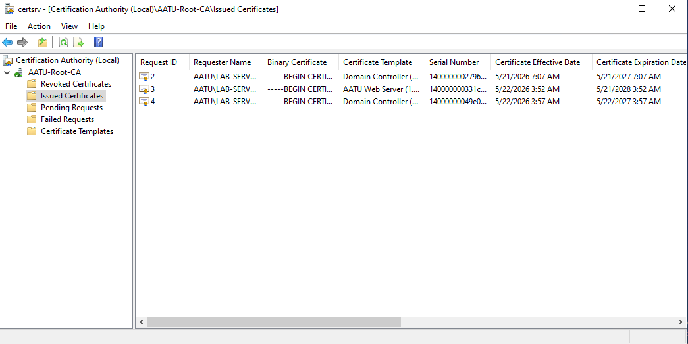
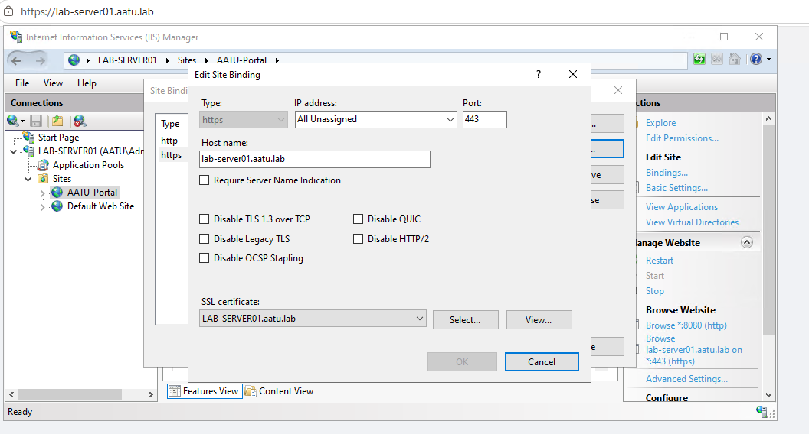
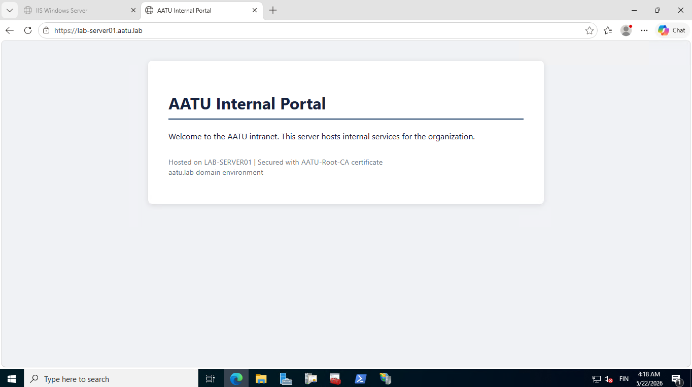
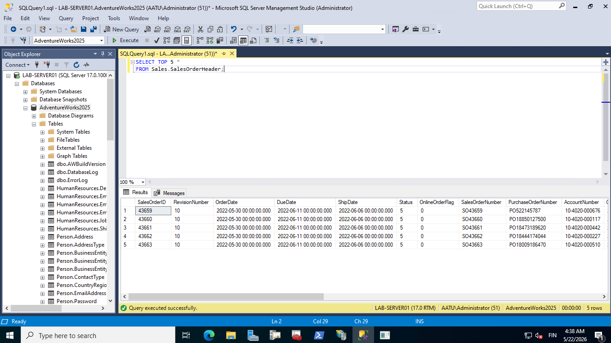
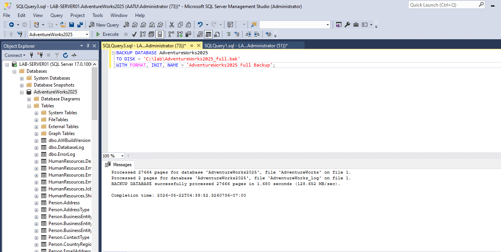
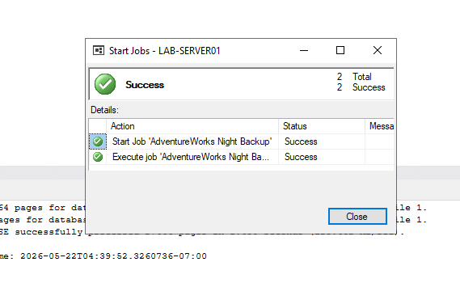
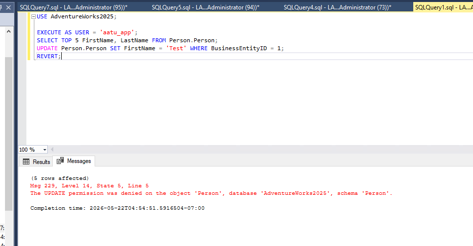

# Windows Server -kotilabra

Hyper-V:lle pystytetty Windows Server 2025 -ympäristö, jossa harjoittelin
hosting- ja ylläpitotehtäviä käytännössä: Active Directory, varmennepalvelut,
IIS, SQL Server ja PowerShell-automaatio.

## Taustaa

Rakensin tämän labran harjoitellakseni Windows Server -ympäristöjen pyörittämistä käytännössä. Halusin testata kykyäni pyörittää Active Directorya, käyttäjähallintaa ja varmenteita.

## Ympäristö

| Komponentti | Tiedot |
|-------------|--------|
| Isäntä | Windows 11 Pro, Hyper-V |
| Virtuaalikone | LAB-SERVER01, Windows Server 2025 |
| IP-osoite | 192.168.1.200 |
| Toimialue | aatu.lab |
| Roolit | AD DS, DNS, AD CS, IIS, SQL Server |

## Mitä rakensin

### Active Directory (AD DS)
Toimialueen pystytys, ADn sisäinen OU-rakenne osastoittain, käyttäjä- ja ryhmähallinta,
Group Policy eri käyttötarkoituksiin.

### Varmennepalvelut (AD CS)
Enterprise Root CA, varmennepohjat, palvelinvarmenteiden myöntäminen.

### IIS
Ympäristöstä löytyy oma HTML-sivu ja julkaisin sen IIS:llä. Lisäsin
HTTPS-sidonnan käyttäen labran omaa CA:ta ja selain tunnistaa varmenteen
ja näyttää https-lukon ilman varoitusta.

### SQL Server
Tietokannan palautus varmuuskopiosta, varmuuskopiointi, SQL Agent
-ajastukset (öisin backup), käyttöoikeuksien hallinta ja testaus.

### PowerShell-automaatio
Skripti käyttäjätunnusten massaluontiin CSV:stä. Turvallista
ajaa uudelleen, ei lahoa vaikka CSVssä olisi samoja nimiä. Katso [scripts/](scripts/).

## Runbookit

Operatiiviset ohjeet kirjoitettuna niin kuin ne menisivät oikeaan
tikettijärjestelmään tai Confluenceen:

- [Käyttäjän onboarding](runbook/user-onboarding.md)

## Mitä opin ja mihin kompastuin

Labran rakentamisessa tuli vastaan oikeita ongelmia. Vianselvitys ja
juurisyiden löytäminen on dokumentoitu erikseen:

- [Vianselvitysmuistiinpanot](docs/opetukset.md)

Esimerkkejä: AD CS:n varmenne-enrollment epäonnistui koska palvelimen
tietokonetili puuttui Domain Computers -ryhmästä; SSMS:n yhteysongelma
encryption-asetuksen vuoksi jne.
